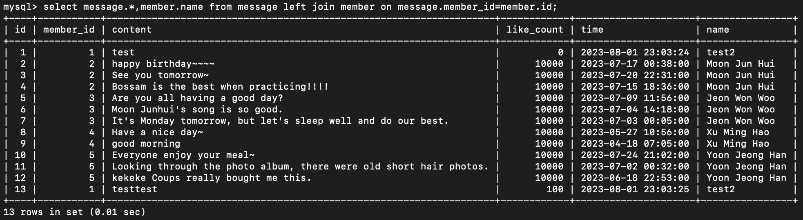

### 要求三
1. 
~~~~sql
insert into member(name,username,password) values('Guo Jia Yu','test','test');
insert into member(name,username,password,follower_count,time) values('Moon Jun Hui','junhui_moon','960610',4976958,'2021-08-30T04:06:10');
insert into member(name,username,password,follower_count,time) values('Jeon Won Woo','everyone_woo','960717',6168080,'2021-07-17T06:07:17');
insert into member(name,username,password,follower_count,time) values('Xu Ming Hao','xuminghao_o','971107',7507918,'2021-07-04T08-11-07');
insert into member(name,username,password,follower_count,time) values('Yoon Jeong Han','jeonghaniyoo_n','951004',6079748,'2021-07-13T02:10:04');
~~~~

2. 
~~~~sql
select * from member;
~~~~

3. 
~~~~sql
select * from member order by time DESC;
~~~~

4. 
~~~~sql
select * from member order by time DESC limit 1,3;
~~~~

5. 
~~~~sql
select * from member where username='test';
~~~~

6. 
~~~~sql
select * from member where username='test' and password='test';
~~~~

7. 
~~~~sql
update member set name='test2' where username='test';
~~~~

### 要求四
1. 
~~~~sql
select count(*) from member;
~~~~

2. 
~~~~sql
select sum(follower_count) from member;
~~~~

3. 
~~~~sql
select avg(follower_count) from member;
~~~~

### 要求五
1. 
~~~~sql
create table message(
    id bigint primary key auto_increment, 
    member_id bigint not null, 
    content varchar(255) not null, 
    like_count int unsigned not null default 0, 
    time datetime not null default NOW(), 
    foreign key(member_id) references member(id)
);
~~~~

2. 
~~~~sql
select message.*,member.name from message left join member on message.member_id=member.id;
~~~~

3. 
~~~~sql
select message.*,member.name from message left join member on message.member_id=member.id where member.username='test';
~~~~

4. 
~~~~sql
select avg(like_count) from (select message.* from message left join member on message.member_id=member.id where member.username='test') as temp;
~~~~

